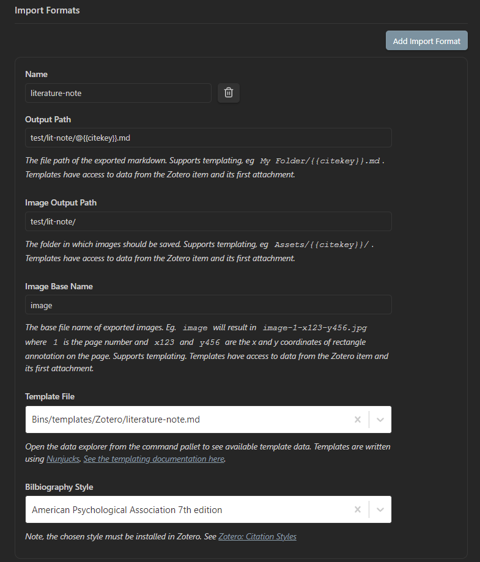
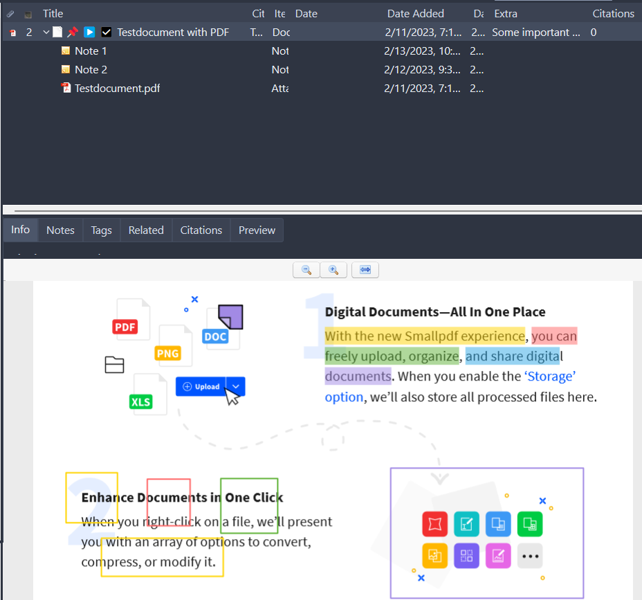
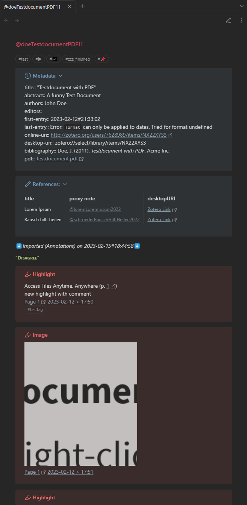

https://github.com/nocona71/obsidian-literature-note

This repository contains:
- markdown template 
- CSS file

MD template and CSS to generate and style a literature note based on Zotero PDF annotations and notes. The template requires: 
- [Obsidian](https://obsidian.md/)
- [Obsidian Zotero Integration plugin](https://github.com/mgmeyers/obsidian-zotero-integration)

# Installation
1. copy [literature-note.md](https://github.com/nocona71/obsidian-literature-note/blob/main/templates/literature-note.md "literature-note.md") into your Obsidian vault 
2. copy [callout-styling.css](https://github.com/nocona71/obsidian-literature-note/blob/main/snippets/callout-styling.css "callout-styling.css") into the snippet folder of your Obsidian vault
3. define an import format in the settings of the [Obsidian Zotero Integration plugin](https://github.com/mgmeyers/obsidian-zotero-integration)^[see. [obsidian-zotero-integration/Export Settings.md at main · mgmeyers/obsidian-zotero-integration · GitHub](https://github.com/mgmeyers/obsidian-zotero-integration/blob/main/docs/Export%20Settings.md)] -> Example below: 

# Usage
After the installation is finished, a new command available in Obsidian's command palette:  
## Example

The generated literature note from information gathered from a Zotero item. It combines the information from the annotations from a PDF and the Zotero notes.
### Input

### Output
The corresponding literature note in Obsidian looks like:

# Features
- literature note generation 
- calculation / inference of the start and end of reading based on the note taking dates
- styling via CSS
